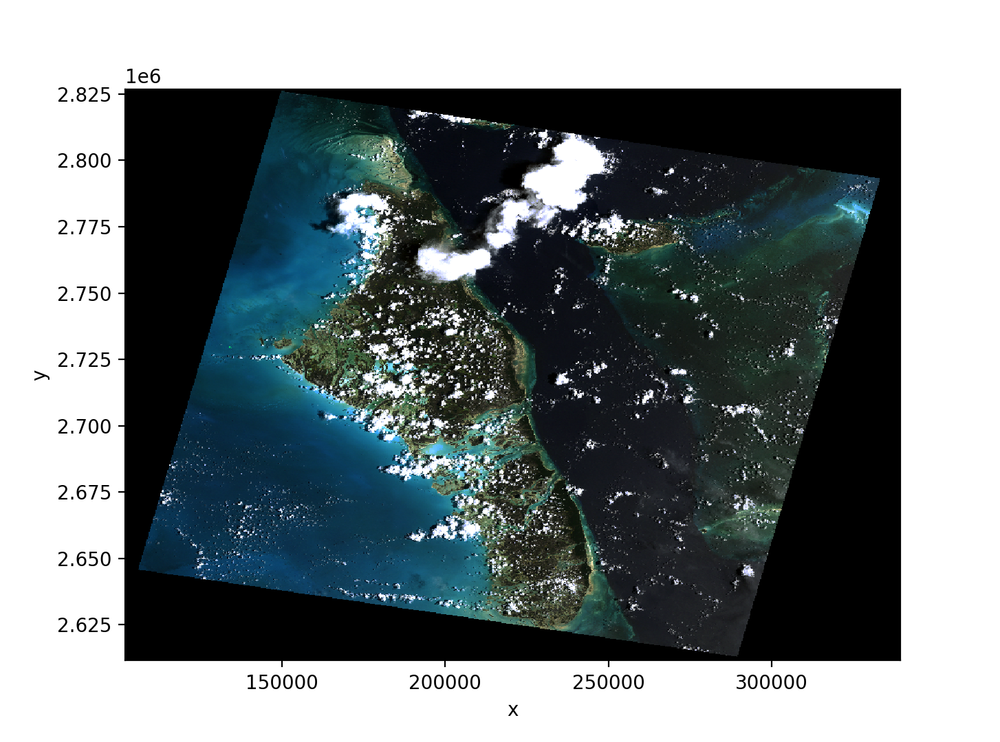

[](https://doi.org/10.5281/zenodo.8327418)
[](https://pypi.org/project/bmi-geotiff)
[](https://anaconda.org/conda-forge/bmi-geotiff)
[](https://github.com/csdms/bmi-geotiff/actions/workflows/build-test-ci.yml)
[](https://bmi-geotiff.readthedocs.io/en/latest/?badge=latest)

# bmi-geotiff

Access data (and metadata) from a GeoTIFF file through an API or a BMI.

The *bmi-geotiff* library accepts a filepath or an URL to a GeoTIFF file.
Data are loaded into an
[xarray](http://xarray.pydata.org/en/stable/)
[DataArray](http://xarray.pydata.org/en/stable/api.html#dataarray)
using the [rioxarray](https://corteva.github.io/rioxarray/stable/index.html)
[open_rasterio](https://corteva.github.io/rioxarray/stable/rioxarray.html#rioxarray.open_rasterio) method.
The API is wrapped with a
[Basic Model Interface](https://bmi.readthedocs.io) (BMI),
which provides a standard set of functions for coupling with data or models
that also expose a BMI.
More information on the BMI can found in its
[documentation](https://bmi.readthedocs.io).

## Installation

Install the latest stable release of *bmi-geotiff* with `pip`:
```
pip install bmi-geotiff
```
or with `conda`:
```
conda install -c conda-forge bmi-geotiff
```

Alternately,
the *bmi-geotiff* library can be built and installed from source.
The library uses several other open source libraries,
so a convenient way of building and installing it is within a
[conda environment](https://docs.conda.io/projects/conda/en/latest/user-guide/tasks/manage-environments.html).
After cloning or downloading the *bmi-geotiff*
[repository](https://github.com/csdms/bmi-geotiff),
change into the repository directory
and set up a conda environment with the included environment file:
```
conda env create --file environment.yml
```
Then build and install *bmi-geotiff* from source with
```
pip install -e .
```

## Examples

A brief example of using the *bmi-geotiff* API is given in the following steps.
The example is derived from a [similar example](http://xarray.pydata.org/en/stable/examples/visualization_gallery.html#imshow()-and-rasterio-map-projections) in the xarray documentation.

Start a Python session and import the `GeoTiff` class:
```python
>>> from bmi_geotiff import GeoTiff
```

For convenience,
let's use a test image from the [rasterio](https://rasterio.readthedocs.io) project: 
```python
>>> url = "https://github.com/rasterio/rasterio/raw/main/tests/data/RGB.byte.tif"
```

Make an instance of `GeoTiff` with this URL:
```python
>>> g = GeoTiff(url)
```
This step might take a few moments as the data are pulled from GitHub.

The data have been loaded into an xarray `DataArray`, which can be accessed through the `da` property:
```python
>>> g.da
<xarray.DataArray (band: 3, y: 718, x: 791)>
[1703814 values with dtype=uint8]
Coordinates:
  * band         (band) int64 1 2 3
  * x            (x) float64 1.021e+05 1.024e+05 ... 3.389e+05 3.392e+05
  * y            (y) float64 2.827e+06 2.826e+06 ... 2.612e+06 2.612e+06
    spatial_ref  int64 0
Attributes:
    STATISTICS_MAXIMUM:  255
    STATISTICS_MEAN:     29.947726688477
    STATISTICS_MINIMUM:  0
    STATISTICS_STDDEV:   52.340921626611
    _FillValue:          0.0
    scale_factor:        1.0
    add_offset:          0.0
    units:               metre
```

Note that coordinate reference system information is stored
in the `spatial_ref` non-dimensional coordinate:
```python
>>> g.da.spatial_ref
<xarray.DataArray 'spatial_ref' ()>
array(0)
Coordinates:
    spatial_ref  int64 0
Attributes:
    crs_wkt:                           PROJCS["WGS 84 / UTM zone 18N",GEOGCS[...
    semi_major_axis:                   6378137.0
    semi_minor_axis:                   6356752.314245179
    inverse_flattening:                298.257223563
    reference_ellipsoid_name:          WGS 84
    longitude_of_prime_meridian:       0.0
    prime_meridian_name:               Greenwich
    geographic_crs_name:               WGS 84
    horizontal_datum_name:             World Geodetic System 1984
    projected_crs_name:                WGS 84 / UTM zone 18N
    grid_mapping_name:                 transverse_mercator
    latitude_of_projection_origin:     0.0
    longitude_of_central_meridian:     -75.0
    false_easting:                     500000.0
    false_northing:                    0.0
    scale_factor_at_central_meridian:  0.9996
    spatial_ref:                       PROJCS["WGS 84 / UTM zone 18N",GEOGCS[...
    GeoTransform:                      101985.0 300.0379266750948 0.0 2826915...
```

Display the image with the [xarray.plot.imshow](http://xarray.pydata.org/en/stable/generated/xarray.plot.imshow.html) method.
```python
>>> import matplotlib.pyplot as plt
>>> g.da.plot.imshow()
>>> plt.show()
```



For examples with more detail,
see the Jupyter Notebooks and Python scripts
included in the [examples](https://github.com/csdms/bmi-geotiff/tree/main/examples) directory
of the *bmi-geotiff* repository.

Documentation for *bmi-geotiff*
is available at https://bmi-geotiff.readthedocs.io.
